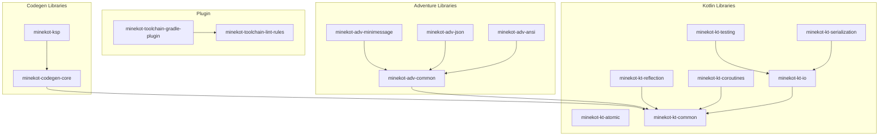

This guide describes the module structure of the MineKot toolchain, explaining how subprojects interact and detailing their architectural boundaries.

## Repository layout

The repository is organized as a multi-project Gradle build. It separates the build logic (the Gradle plugin and static analysis rules) from the utility libraries:

```text
minekot-toolchain/
├── gradle/                     # Gradle wrapper and build configuration scripts
├── libraries/                  # Utility and core libraries
│   ├── adventure/              # Kyori Adventure wrappers and layout helpers
│   ├── codegen/                # Code generation and annotation processing utilities
│   └── kotlin/                 # Native Kotlin utility modules
├── plugin/                     # Build tools and plugins
│   ├── lint-rules/             # Custom Detekt static analysis rules
│   └── toolchain/              # The main MineKot Gradle toolchain plugin
└── samples/                    # Verification and smoke test projects
```

## Plugin modules

The build system and static analysis logic live inside the `plugin` directory:

- **`:plugin:toolchain` (`minekot-toolchain-gradle-plugin`)** - This is the central entry point. It registers DSL properties, sets up the Java/Kotlin toolchain, wires Maven publishing pipelines, configures Shadow JAR rules, and coordinates the automatic injection of utility libraries into user projects.
- **`:plugin:lint-rules` (`minekot-toolchain-lint-rules`)** - Contains custom Detekt rules that analyze AST structures to enforce MineKot-specific practices, such as requiring braces in string templates, rejecting legacy Bukkit color formatting, and enforcing functional error handling.

## Library modules

The libraries are divided by core technology to allow consuming projects to pull in only the dependencies they require.

### Kotlin utilities

Located in `libraries/kotlin`, these modules provide standard Kotlin boilerplate reducers:

- **`common` (`minekot-kt-common`)** - Provides typed IDs/keys, validation checks, and functional parsing helpers (like `toMineKotUuidResult` and `toMineKotEnumResult`) that return structured `Result` wrappers instead of throwing raw exceptions.
- **`io` (`minekot-kt-io`)** - Wraps `kotlinx-io` to provide safe path operations, atomic file writes, recursive directory deletion, resource extraction, and URL-based class loaders.
- **`serialization` (`minekot-kt-serialization`)** - Integrates `kotlinx-serialization` with configuration files, providing configuration loading, lenient JSON defaults, and migration chains for handling config updates.
- **`coroutines` (`minekot-kt-coroutines`)** - Simplifies concurrency with dispatcher utilities, timeout `Result` handling, retries, bounded parallel mappings, and supervised coroutine lifetimes.
- **`atomic` (`minekot-kt-atomic`)** - Provides atomic state containers, once-gates, close-gates, and conditional state updates.
- **`reflection` (`minekot-kt-reflection`)** - Simplifies property access, sealed subclass discovery, and Java ServiceLoader wrapper utilities.
- **`testing` (`minekot-kt-testing`)** - Exposes reusable test fixtures, `Result` type assertions, temporary workspace cleanups, and Gradle runner utilities.

### Adventure utilities

Located in `libraries/adventure`, these modules wrap Kyori Adventure for rich-text handling:

- **`common` (`minekot-adv-common`)** - Standardizes word and line joins, bullet list layouts, key-value rows, and plain-text serialization.
- **`minimessage` (`minekot-adv-minimessage`)** - Validates MiniMessage templates, rejects legacy legacy-color symbols, and supports secure tag allowlists.
- **`json` (`minekot-adv-json`)** - Integrates Adventure components with `kotlinx-serialization` for direct serialization.
- **`ansi` (`minekot-adv-ansi`)** - Translates Adventure components into ANSI terminal colors and strips color codes.

### Code generation utilities

Located in `libraries/codegen`, these modules support code generation and compiler plugins:

- **`core` (`minekot-codegen-core`)** - Provides wrappers on top of KotlinPoet to simplify generating type-safe models, enums, and generated headers.
- **`ksp` (`minekot-ksp`)** - Simplifies writing KSP processors by providing typed annotation argument lookups, deferred symbol helpers, and file writing utilities.

## Module interaction and dependencies

The dependencies between modules are designed to prevent circular references and maintain strict architectural boundaries:



## Architectural boundaries

When modifying or extending the toolchain modules, you must adhere to these structural boundaries:

- **Platform independence** – The toolchain libraries must remain 100% platform-independent. They must not depend on Bukkit, Paper, Fabric, NeoForge, Velocity, or any other Minecraft server or modding API. Platform adapters are built as downstream modules in separate repositories.
- **Kotlinx preference** – Do not introduce dependency references to Java standard IO, Java standard serialization, or raw thread concurrency. Always use the respective `kotlinx` library instead (such as `kotlinx-io`, `kotlinx-serialization`, or `kotlinx-coroutines`).
- **Feature descriptors** – The toolchain plugin uses feature descriptors (inside `mineKotLibraryFeatureDescriptors`) to track available utility modules and their dependencies. This allows the plugin to wire libraries into user builds dynamically without hardcoding module mappings in build-time tasks. If you add a new library module, you must register it in the plugin's descriptor registry.
